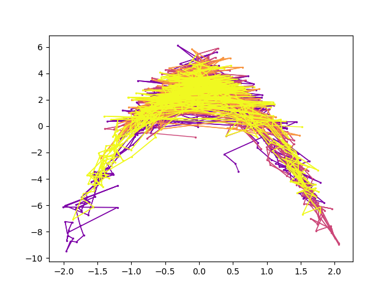

# _torchmcee_

## Collection of Monte Carlo sampling methods implemented in PyTorch with high parallelization in mind.

Under development. Currently supported samplers:

- Hamiltonian Monte Carlo. Unlike __Pyro__ or __hamiltorch__ implementations, it supports parallel computation for multiple chains.

- Affine-Invariant Markov Chain Monte Carlo (inspired by numpy implementation in __emcee__ package)

- Layered Adaptive Importance Sampling

- Hamiltonian Adaptive Importance Sampling


## Examples

HMC sampler for banana distribution: 

```python
import torch

from torchmcee import MCMCSampler, HMCStep
from torchmcee.utils import set_random_seed
from torchmcee.examples.benchmarks import banana_log_prob
from torchmcee.examples.utils import plot_mcmc_chains


def main(
        num_steps: int = 400,
        num_chains: int = 4,
        device: str = 'cuda',
):
    set_random_seed(777)
    dim = 2
    hmc = HMCStep(num_steps_per_sample=20, step_size=0.05)
    sampler = MCMCSampler(hmc)
    init_params = torch.randn(num_chains, dim, device=device) * 2
    sampler.run(init_params, banana_log_prob, num_steps)
    plot_mcmc_chains(sampler.backend)
```


